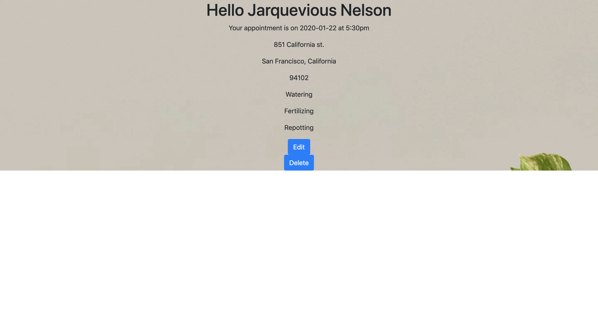

## Green thumbs is an on-demand indoor plant maintenance web app. Plant parents can order a plant maintenance technician to help with watering, repotting, and fertilizing there indoor plants. 

# Motivation
## Plant Parents often forget to water their indoor plants. They often don't have knowledge on plant care. Green thumbs solves this problem by offering plant maintanance services to help plant parents maintain  their plants. The motivation comes from friends and family frequently complaining about thier plants always dieing and forgetting to water them. After conducting user research, I found that most people don't know to fertilize or repot plants. Lastly, according to several online sources, succelent sales have increased tenfold since 2010. Now is a good time to capitlaize on this growing trend. 

## Demo

## Heroku Link: https://greenthumbs-jne.herokuapp.com/

## Screenshots

## Built with
# Flask
# Python
# MongoDB
# Bootstrap
# Heroku

